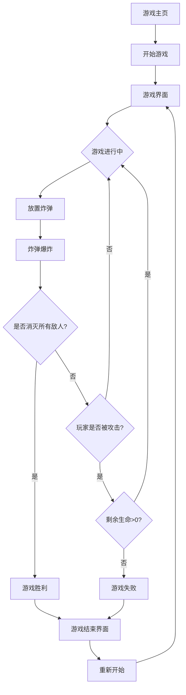

## 1. Product Overview
类泡泡堂游戏是一款休闲竞技游戏，玩家通过放置炸弹来消灭敌人并破坏障碍物。
- 主要目标是提供一款简单易上手但富有策略性的休闲游戏，适合各年龄段用户。
- 目标用户为喜欢休闲竞技游戏的玩家，特别是移动端和网页端用户。

## 2. Core Features

### 2.1 User Roles
| Role | Registration Method | Core Permissions |
|------|---------------------|------------------|
| Player | 无需注册 | 可直接进入游戏，选择角色，开始游戏 |

### 2.2 Feature Module
1. **游戏主页**: 游戏标题，开始游戏按钮，设置选项
2. **游戏界面**: 游戏地图，玩家角色，炸弹，敌人，道具，计分板
3. **游戏结束界面**: 游戏结果，重新开始按钮

### 2.3 Page Details
| Page Name | Module Name | Feature description |
|-----------|-------------|---------------------|
| 游戏主页 | 游戏标题 | 显示游戏名称和logo，营造游戏氛围 |
| 游戏主页 | 开始游戏按钮 | 点击进入游戏界面，开始新游戏 |
| 游戏主页 | 设置选项 | 调整音效和背景音乐开关 |
| 游戏界面 | 游戏地图 | 显示游戏场景，包括墙壁、障碍物和可破坏的砖块 |
| 游戏界面 | 玩家角色 | 可控制移动，放置炸弹，收集道具 |
| 游戏界面 | 炸弹 | 放置后倒计时爆炸，产生火焰，可破坏砖块和敌人 |
| 游戏界面 | 敌人 | 自动移动，会攻击玩家，被炸弹击中后消灭 |
| 游戏界面 | 道具 | 随机出现在破坏的砖块位置，包括增加炸弹数量、火焰长度、速度等 |
| 游戏界面 | 计分板 | 显示玩家分数和剩余生命 |
| 游戏结束界面 | 游戏结果 | 显示游戏胜利或失败信息，以及最终分数 |
| 游戏结束界面 | 重新开始按钮 | 点击重新开始游戏 |

## 3. Core Process
玩家进入游戏主页，点击开始游戏按钮进入游戏界面。在游戏界面中，玩家通过方向键或虚拟按钮控制角色移动，按空格键或虚拟按钮放置炸弹。炸弹会在一段时间后爆炸，产生火焰，可破坏砖块和消灭敌人。玩家需要躲避炸弹和敌人的攻击，同时收集道具来增强自身能力。当玩家消灭所有敌人或被敌人攻击次数达到上限时，游戏结束，显示游戏结果。

## 4. User Interface Design
### 4.1 Design Style
- 主色调: 明亮的蓝色(#4A90E2)和绿色(#50E3C2)作为主色，黄色(#F5A623)作为强调色
- 按钮风格: 圆角按钮，有轻微的3D效果，点击时有按压动画
- 字体: 圆润可爱的无衬线字体，主标题使用较大字号(24-32px)，游戏内文字使用中等字号(16-18px)
- 布局风格: 卡通风格，界面元素有轻微的阴影和发光效果
- 图标/emoji风格: 使用圆润可爱的卡通图标，敌人和道具设计简洁明了

### 4.2 Page Design Overview
| Page Name | Module Name | UI Elements |
|-----------|-------------|-------------|
| 游戏主页 | 游戏标题 | 大字号彩色标题，带有轻微的动画效果，背景为游戏场景的缩略图 |
| 游戏主页 | 开始游戏按钮 | 醒目的黄色圆角按钮，悬停时有放大效果 |
| 游戏主页 | 设置选项 | 齿轮图标，点击后弹出设置面板 |
| 游戏界面 | 游戏地图 | 网格布局，墙壁为深色，可破坏砖块为浅色，有纹理效果 |
| 游戏界面 | 玩家角色 | 彩色卡通人物，有简单的动画效果，移动时有脚步声 |
| 游戏界面 | 炸弹 | 圆形，有倒计时动画，爆炸时有火焰效果和音效 |
| 游戏界面 | 敌人 | 不同颜色和形状的卡通敌人，移动时有简单的动画 |
| 游戏界面 | 道具 | 不同形状和颜色的图标，出现时有闪烁效果 |
| 游戏界面 | 计分板 | 位于屏幕顶部，显示分数和剩余生命，有简单的动画效果 |
| 游戏结束界面 | 游戏结果 | 大字号文字，胜利时为绿色，失败时为红色，带有简单的动画效果 |
| 游戏结束界面 | 重新开始按钮 | 醒目的绿色圆角按钮，点击时有按压动画 |

### 4.3 Responsiveness
- 移动端优先设计，适配不同屏幕尺寸
- 触摸屏设备显示虚拟方向键和操作按钮
- 桌面端使用键盘控制，界面元素适当放大
- 响应式布局，确保在不同设备上都有良好的游戏体验

### 4.4 3D Scene Guidance
- 游戏采用2D平面设计，不需要3D场景
- 界面元素有轻微的阴影和发光效果，营造层次感
- 动画效果流畅，确保游戏体验的连贯性