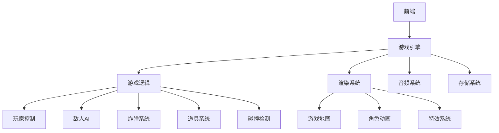
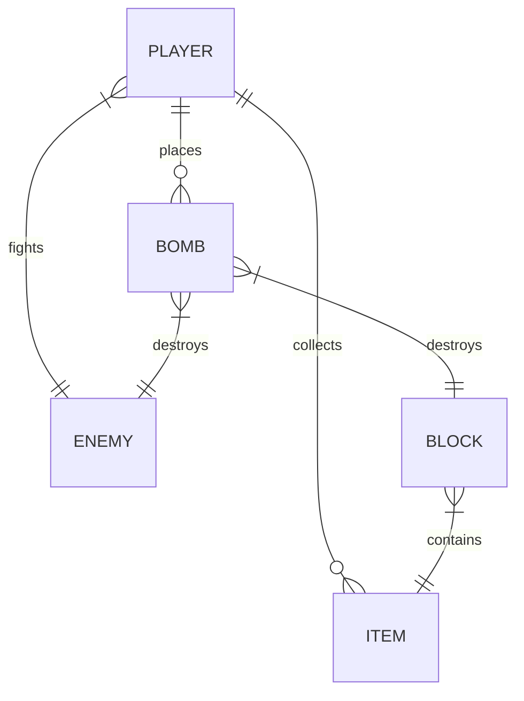

## 1. Architecture Design

## 2. Technology Description
- Frontend: React@18 + tailwindcss@3 + vite
- Initialization Tool: vite-init
- Backend: None (纯前端实现)
- Database: 本地存储 (localStorage) 用于保存游戏设置和分数

## 3. Route Definitions
| Route | Purpose |
|-------|---------|
| / | 游戏主页 |
| /game | 游戏界面 |
| /gameover | 游戏结束界面 |

## 4. API Definitions
- 无需后端API，所有游戏逻辑在前端实现

## 5. Server Architecture Diagram
- 无需服务器架构，纯前端实现

## 6. Data Model
### 6.1 Data Model Definition

### 6.2 Data Definition Language
- 游戏状态数据结构
  - 玩家状态: 位置、生命值、炸弹数量、火焰长度、移动速度
  - 敌人状态: 位置、生命值、移动方向、速度
  - 炸弹状态: 位置、倒计时、火焰长度
  - 道具状态: 位置、类型
  - 地图状态: 网格布局、墙壁、可破坏砖块

- 本地存储数据
  - 游戏设置: 音效开关、背景音乐开关
  - 游戏分数: 最高分数记录